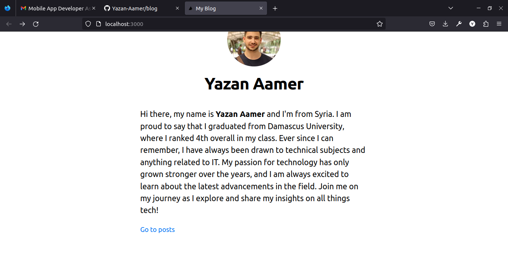
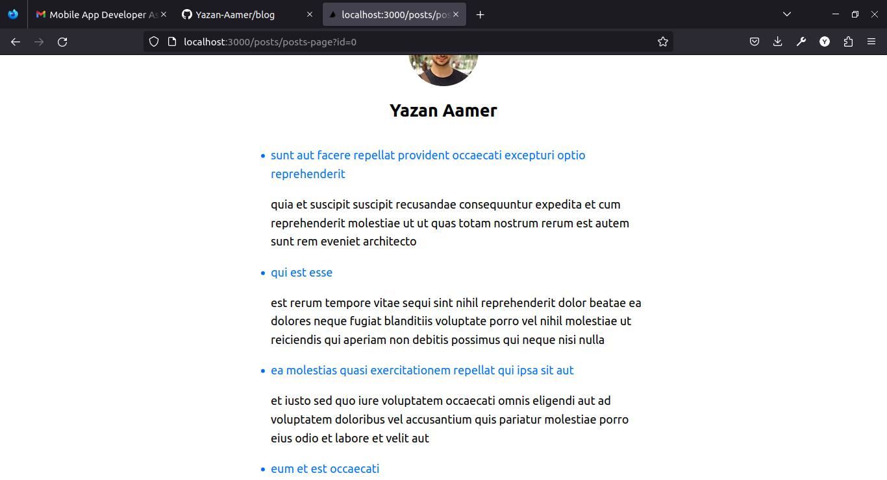

## Yazan Aamers Blog.

## Quick notes
* The project is writtent in the nextJs framework.
* It uses jsonplaceholder.com for getting posts data.

## TODO
- [x] Implement intro page.
- [x] Write basic info.
- [x] Implement layout as a separate component.
- [x] Implement the posts page.
- [x] Paginate posts.
- [x] Add basic design.
- [ ] create a form for creating a new post.
- [ ] updating new post.
- [ ] view each post in its own path.

## Some screenshots

